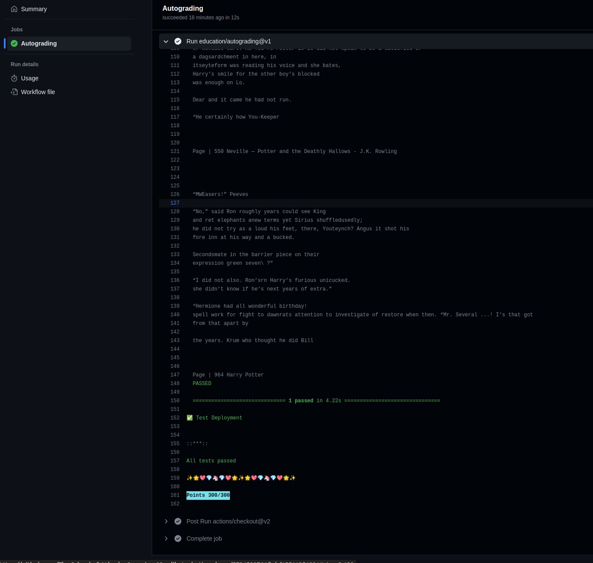

# EMLOv3 | Assignment 9

This repo contains the codebase for the GPT docker image which was pushed to AWS ECR and deployed via AWS ECS Fargate.
After successful launch, URL was updated in the deployment.json file present in the Github Classroom repo.

## Past Documentation

- [Assignment 4](https://github.com/salil-gtm/emlov3_assignment_4)
- [Assignment 5](https://github.com/salil-gtm/emlov3_assignment_5)
- [Assignment 6](https://github.com/salil-gtm/emlov3_assignment_6)
- [Assignment 7](https://github.com/salil-gtm/emlov3_assignment_7)
- [Assignment 8](https://github.com/salil-gtm/emlov3_assignment_8)

## Author

- Salil Gautam
